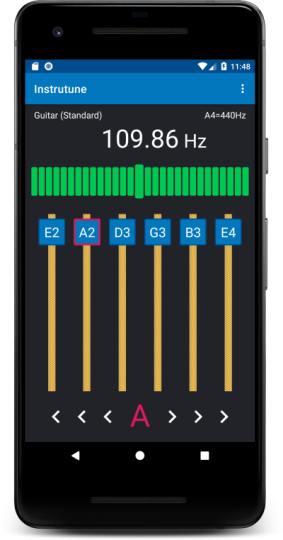
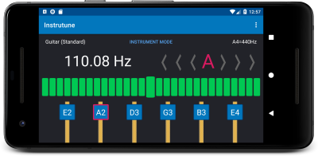
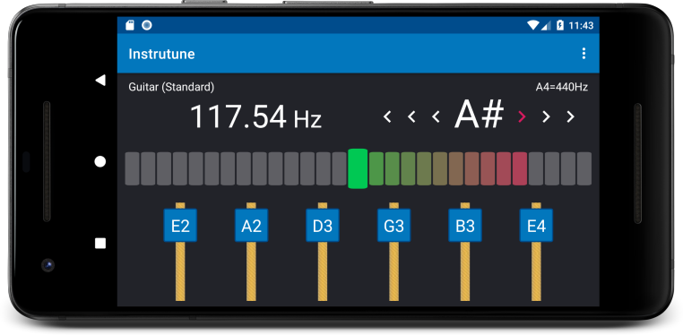
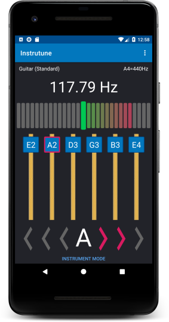
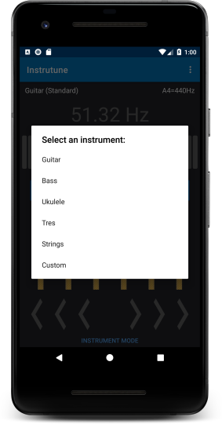
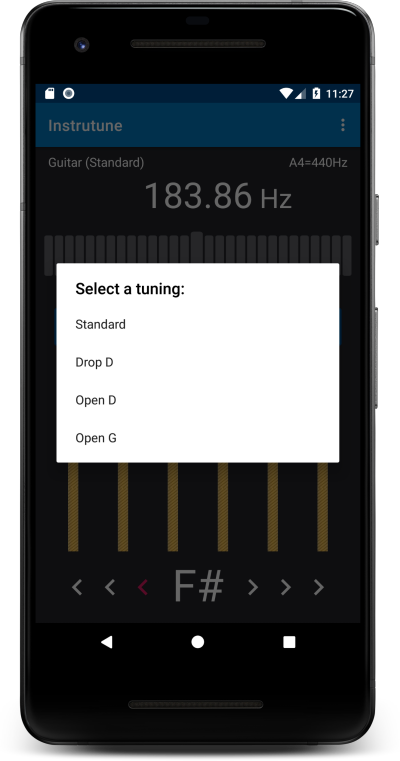
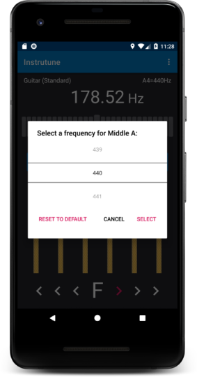
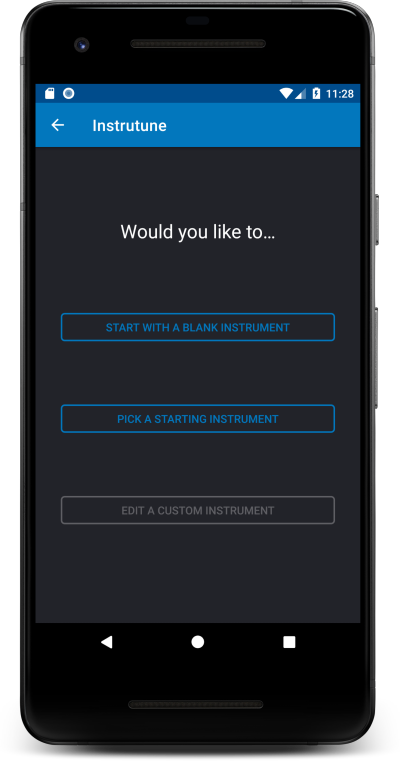
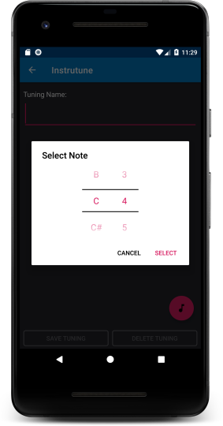
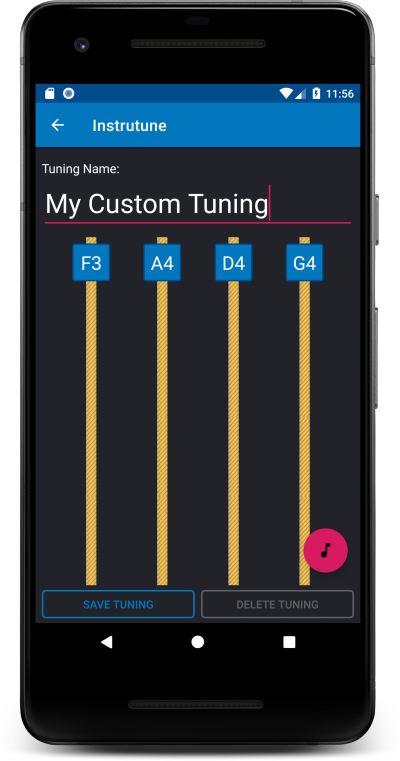

# Instrutune

An Android app written in Kotlin for tuning instruments.
The app currently supports multiple tunings for:
* Guitar
* Bass
* Tres
* Ukulele

As well as tunings for:
* Violin
* Viola
* Cello
* Chromatic

The tuner allows you to adjust the middle A frequency, allowing you to tune to A = 432 Hz and other tunings.

&nbsp;&nbsp;&nbsp;&nbsp;

&nbsp;&nbsp;&nbsp;&nbsp;

The app also has a feature that allows you to create custom tunings.

&nbsp;&nbsp;&nbsp;&nbsp;

## Built With

* [Kotlin](https://kotlinlang.org/) - Kotlin programing language
* [TarsosDsp](https://github.com/JorenSix/TarsosDSP) - A Real-Time Audio Processing Framework in Java
* [Kodein](https://github.com/Kodein-Framework/Kodein-DI) - Painless Kotlin Dependency Injection
* [Android Architecture Components](https://developer.android.com/topic/libraries/architecture/index.html) - For managing Android UI lifecycle
* [RxJava](https://github.com/ReactiveX/RxJava) - Reactive Extensions for the JVM
* [RxKotlin](https://github.com/ReactiveX/RxKotlin) - Kotlin Extensions for RxJava

## Acknowledgments

* [How to calculate the frequencies of musical notes](https://codepen.io/enxaneta/post/frequencies-of-musical-notes) - This article was very helpful for deciding how to model musical notes and the chromatic scale.
* [React Native Blueprints](https://www.packtpub.com/web-development/react-native-blueprints) - This book has a guitar tuner project that served as the original inspiration for this project.
